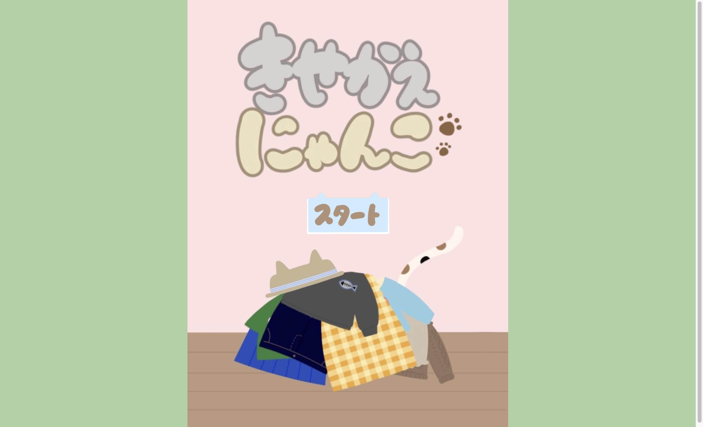
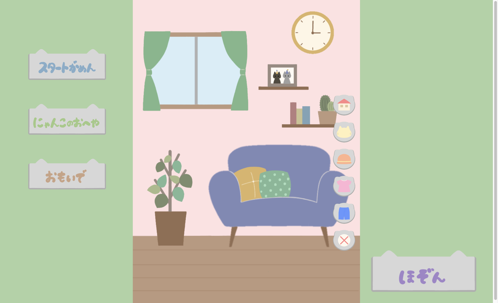
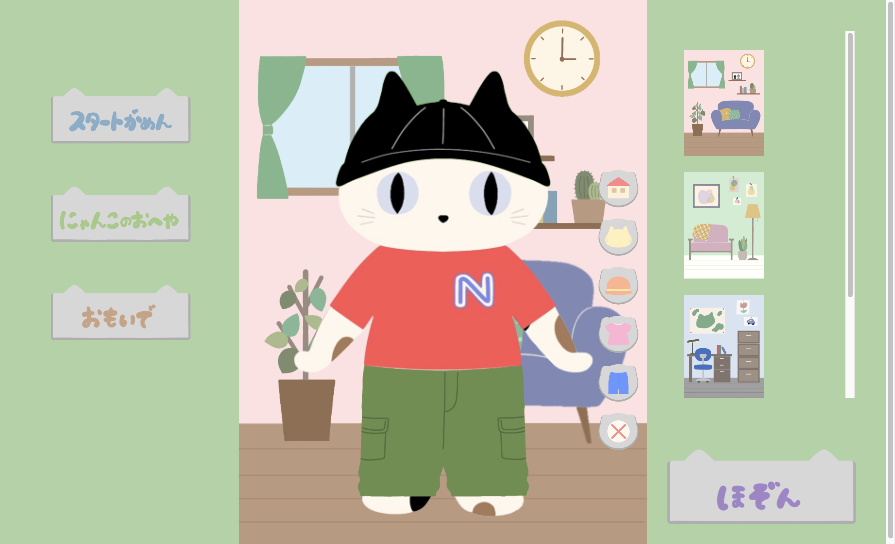
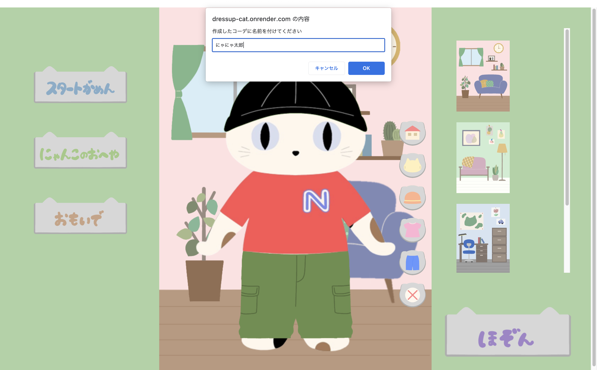
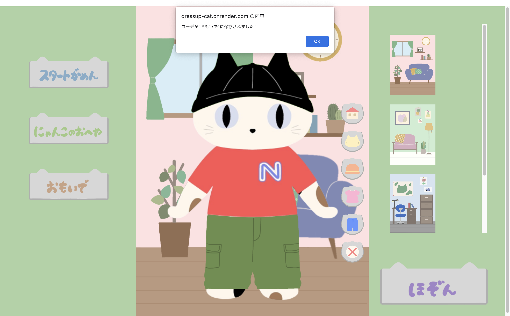

# 着せ替えにゃんこ

「着せ替えにゃんこ」は好きなにゃんこや服、お部屋を選んで
自分だけのにゃんこを作ってシェアできるサービスです。

# サービスの URL

着せ替えにゃんこを遊ぶにはこちらのリンクをクリックしてください。

<https://dressup-cat.onrender.com>

# このサービスを作った理由

ある日、Nintendo Switch で着せ替えゲームをやっている妻を
見て、猫の着せ替えゲームを作ったら面白いのでは。と思い制作しました。

このサービスで使用しているイラストは全て妻が描いてくれました！！
ロード後に自分の声でタイトルの読み上げボイスを付けようと思いましたが
妻から台無しになると言われ、断念しました。

ゆくゆくは実際のサービスとして、リリースしたいです。

# 遊び方

### スタートがめん

### にゃんこの部屋

### にゃんこの着せ替え

### コーデに名前を付ける

### おもいで

# 使用技術

| Category       | Technology Stack           |
| -------------- | -------------------------- |
| Frontend       | React,JavaScript           |
| Infrastructure | Render                     |
| Backend        | JavaScript,Node.js,Express |
| Database       | PostgreSQL                 |
| Test           | Mocha,chai                 |
| CI/CD          | GitHub                     |
| etc.           | Prettier,PlantUML          |
