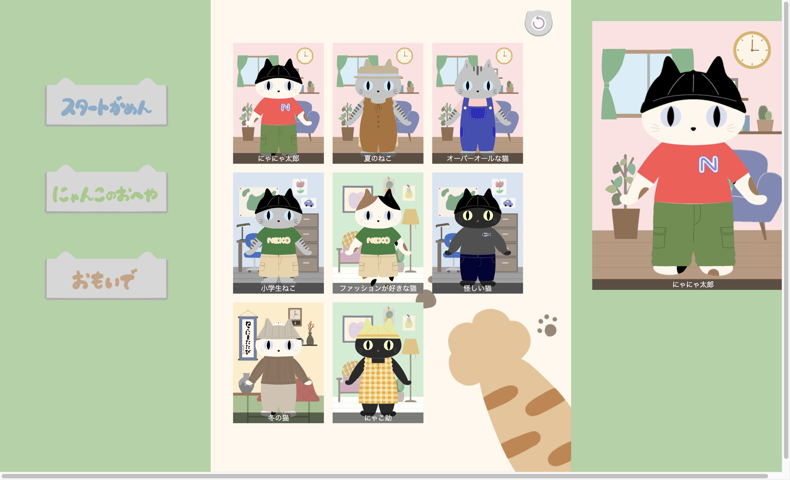

# 着せ替えにゃんこ

「着せ替えにゃんこ」は好きなにゃんこや服、お部屋を選んで
自分だけのにゃんこを作ってシェアできるサービスです。

# サービスの URL

着せ替えにゃんこを遊ぶにはこちらのリンクをクリックしてください。

<https://dressup-cat.onrender.com>

# このサービスを作った理由

ある日、Nintendo Switch で着せ替えゲームをやっている妻を
見て、猫の着せ替えゲームを作ったら面白いのでは。と思い制作しました。

このサービスで使用しているイラストは全て妻が描いてくれました！！
ロード後に自分の声でタイトルの読み上げボイスを付けようと思いましたが
妻から台無しになると言われ、断念しました。

将来の計画として、ゆくゆくは実際のサービスとして、リリースしたいです。

# 遊び方

### スタートがめん

早速スタートを押して、にゃんこの着せ替えを始めましょう！

### にゃんこの部屋

右側に縦に並んだ、ボタンを押して好きな部屋と猫と服装を選ぶことが出来ます！

### にゃんこの着せ替え

にゃんこに服を着せたら、右下のほぞんボタンを押しましょう！

### コーデに名前を付ける

あなたが作ったコーデに好きな名前を付けてください！
もし、空白の場合は「無名のにゃんこ」として登録されます。

OK を押すと保存されます。
キャンセルを押すと保存がキャンセルされます。

### おもいで

「おもいで」であなたが作ったコーデと、みんなが作ったコーデを
見ることが出来ます。
好きなコーデを見つけたら、クリックすると拡大します！

また、コーデを消すことは出来ません！なぜなら、「おもいで」は消えないからです。

# セットアップ

##

# 使用技術

| Category       | Technology Stack           |
| -------------- | -------------------------- |
| Frontend       | React,JavaScript           |
| Infrastructure | Render                     |
| Backend        | JavaScript,Node.js,Express |
| Database       | PostgreSQL                 |
| Test           | Mocha,chai                 |
| CI/CD          | GitHub                     |
| etc.           | Prettier,PlantUML          |
